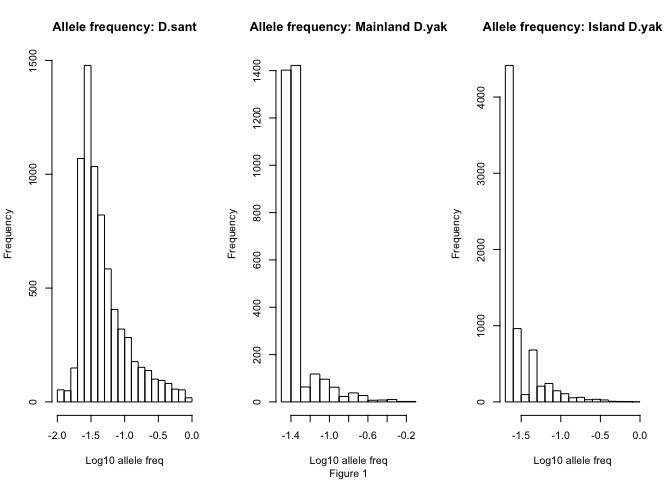
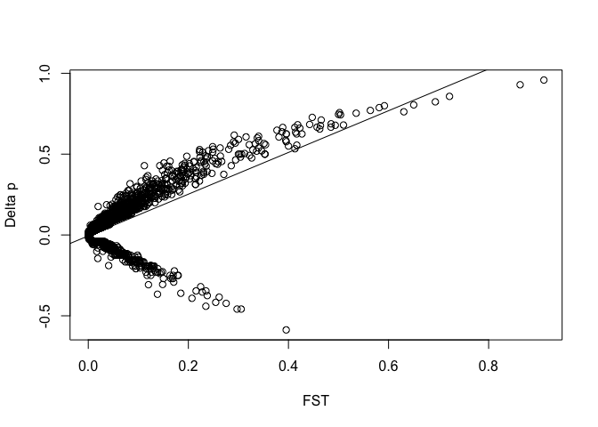
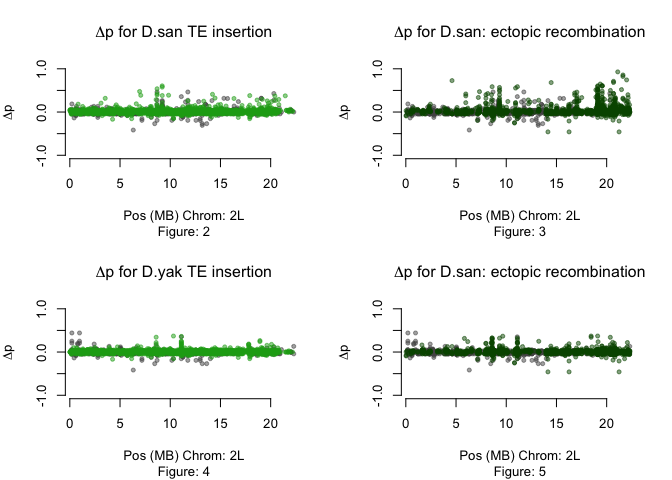
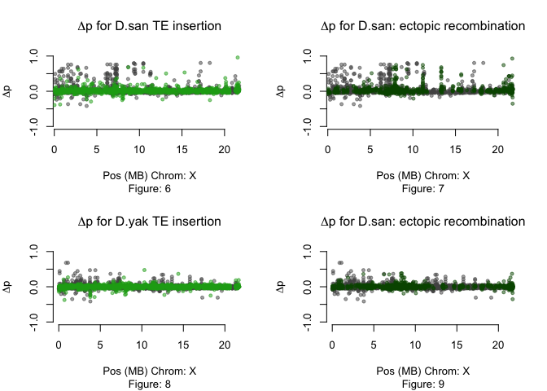

Structural Variation in *Drosophila santomea*
================
Brandon Turner
4/22/2021

### Introduction

The appearance of new genes through the reorganization of existing genetic material is a unique source of genetic variation within populations. Chromosomal rearrangements act as a source of this genetic variation and divergence by shuffling DNA throughout the genome. Novel genetic variation in the forms of de novo gene formation, chimeric genes, or changes in gene expression can be introduced in the populations due to these mutations in genetic structure. To better understand the role that these various mutations play in evolutionary biology I observe changes in the *Drosophila* genome by analyzing 44 strains of *Drosophila santomea* and 22 strains of *Drosophila yakuba*. I identify 16,779 rearrangements through both populations and calculated the allele frequency of each population to assess population differentiation between *D. yakuba* and *D.santomea*.

I speculate that **Hypothesis 1:** The distribution of the allele frequency for the rearrangement's is significantly different between the 3 populations, **Hypothesis 2:** In all populations, there is a positive correlation between the FST/deltap, where FST is calculated on Mainland Dyak and Island Dsant, and **Hypothesis 3 :** Deltap is significanlty different when comparing *D.sant* and *D.yak*.

Recent technological innovation has allowed us to identify such variation in high throughput large scale genome sequencing panels, opening doors to study evolutionary impacts in new organisms or systems beyond standard models. We are able to discover how these mutations contribute to population variation and how their allele frequencies shift in differing environmental contexts. One evolutionary system that has experienced such habitat shifts is the - species complex. As a common model organism, remain an excellent resource for evolutionary analysis. and are two sister species of that live on Sao Tome, an island off the coast of west Africa (Lachaise, D. et al 2000). These two species inhabit separate elevations on the island, with living in higher elevations and absent in the lower regions of the island where is abundant. They do have a contact zone in the middle, however, where hybrids can occur. This provides a unique opportunity to study and understand genetic variation between two closely related species.

This complex is ideal for population genetics of local adaptation as it has invaded far enough in the past that phenotypic and genetic differentiation can occur. However, it is not yet so long in the past that population genetic signals are obscured by new mutations and left to be seen only in species divergence. It further benefits from a known ancestral mainland population that is well characterized for structural variation. To build on these clear strengths of the - system, we have generated population genetic panels for and Sao Tome with paired end Illlumina and PacBio HiFi sequencing. We pair these data with gene expression analysis to identify cases where structural variants alter expression or create new genes. This comprehensive portrait of structural variation in local adaptation on Sao Tome can serve as the basis for future insights on evolutionary responses in shifting selective pressures.

### Methods

Haplotype calls from the HMM were used to generate correct site frequnency spectra for SNPs and structural variants. The structural variant data were mapped into the haplotype calls and associated with their haplotype information. Mutations that did not have more that 3 supporting reads were removed from analysis (expand?). Mutation data for that did not have a find a region to map to were removed from analysis due to reference contamination. ones that did not map to a haplotype call were assumed to be heterozygous. The mutation data were then clustered by separating the rearrangements by chromosome and then binning them based on the origin locus of the variant on the chromosome. Variants that were within 325 base pairs of each other on from either the origin or destination loci, resulting in mutation clusters being associated with a minimum and maximum loci for each cluster representing the origin and destination loci, and a list of all strains that were observed to be in the cluster.

By using the haplotype data we determine the number of sampled strains and compare them to the number of observed strains in the clustered rearrangements. We use this to calculate the allele frequency for each of the variants that we observed. We also calculated the allele frequency by sub-population for and the . With the allele frequency data for each variant and the separation by sub-population, we calculate the fixation index (Equation 1) to estimate the population differentiation between the two species due to the chromosomal rearrangements.

To calculate the allele frequencies for each subpopulation, I mapped the mutation call positions into the haplotype calls. After I had mapped the mutatation calls to their haplotype regions, I clustered the mutations using a clustering algorithim I wrote in Python. It clustered the mutations across strains if they were within 325 base pairs of each other because that is our sequence data's library insert size. Once the mutations were clustered across strains, I was able to calcualte the allele frequency for each rearrangment. Furthermore, by using regex I was able to calculate the allele frequency at a rearrangment site by subpopulation as well. The three subpopulations are island *D.santomea*, island *D.yakuba*, and mainland *D.yakuba*.

Afterwards, I used BLAST to compare the sequence data at the rearrangment breakpoints (+/-1kb) against Repbase to search for matches to repetive elements, as well as the *Drosophila teisseire* reference genome so that I could polarize the anscetral state. If a rearrangmenet had one breakpoint match to a TE in Repbase it was marked as a TE insertion, and if both breakpoints matched it is assumed that the rearrangmenet is facilitating ectopic recombination. When polarizing the anscestral state, both breakpoints needed to map to the same location in the *D. tei* reference genome, and if they did then the allele frequency was flipped (1 - p\_i; s.t p\_i = allele frequency of i\_th population).

I also used coverage data to correct for heterozygosity. By checking the coverage data and searching for 2x coverage at the breakpoints we can infer that the site is heterzygous, and when calculating allele frequency we consider the site 2/2 rather than 1/2.

Once these corrections are added to the calculation of the allele frequency, I expored the data to R so that it could be plotted. Once I had the data in R, I ran statistical analysis to explore my hypotheses using the Wilcoxin rank-sum test, the Kolmogorov–Smirnov test, and the Kendall test. I also calculate and analyze deltap. Deltap = p\_1 - p\_2; s.t p\_i = the allele frequency of the i\_th populaton.

### Results

Figure 1 is a histogram of the allele frequencies for each subpopulation that has been log10 transformed.



**Hypothesis 1:** The results for all tests show that the distribtuion of allele frequencies between the populations for all tests are significantly different after running a Wilcoxin-rank sum test and a Kolmogorov-Smirnov test.

###### *D.santomea* vs. Mainland *D.yakuba*:

``` r
wc1 = wilcox.test(dsan_grey_fullFile$V9, dsan_grey_fullFile$V12)
ks.test(dsan_grey_fullFile$V9, dsan_grey_fullFile$V12)
```

    ## 
    ##  Two-sample Kolmogorov-Smirnov test
    ## 
    ## data:  dsan_grey_fullFile$V9 and dsan_grey_fullFile$V12
    ## D = 0.2522, p-value < 2.2e-16
    ## alternative hypothesis: two-sided

###### Island *D.yakuba* vs. Mainland *D.yakuba*:

``` r
wilcox.test(dsan_grey_fullFile$V9, dsan_grey_fullFile$V12)
```

    ## 
    ##  Wilcoxon rank sum test with continuity correction
    ## 
    ## data:  dsan_grey_fullFile$V9 and dsan_grey_fullFile$V12
    ## W = 141398903, p-value < 2.2e-16
    ## alternative hypothesis: true location shift is not equal to 0

``` r
ks.test(dsan_grey_fullFile$V9, dsan_grey_fullFile$V12)
```

    ## 
    ##  Two-sample Kolmogorov-Smirnov test
    ## 
    ## data:  dsan_grey_fullFile$V9 and dsan_grey_fullFile$V12
    ## D = 0.2522, p-value < 2.2e-16
    ## alternative hypothesis: two-sided

**Hypothesis 2:** The Kendall test shows that the two populations are not independent of each other. This can also be seen in a scatter plot with a best fit line that shows generally positive correlation.

``` r
library(Kendall)
Kendall(dsan_grey_fullFile$V9-dsan_grey_fullFile$V12, dsan_grey_fullFile$V15)
```

    ## tau = 0.327, 2-sided pvalue =< 2.22e-16

``` r
# regression
myMod = lm(dsan_grey_fullFile$V9-dsan_grey_fullFile$V12 ~ dsan_grey_fullFile$V15)
plot(dsan_grey_fullFile$V15, dsan_grey_fullFile$V9-dsan_grey_fullFile$V12, xlab='FST', ylab='Delta p')
abline(myMod)
```



**Hypothesis 3 :** Deltap shows the differentiation of populations at sites accross the genome when comparing the (p\_santome - p\_main\_yakuba) and between (p\_island\_yakuba - p\_main\_yakuba). The points highlighted in light green are rearrangements that are TE insertions, and dark green points are sites that are likely facilitating ectopic recombination. Figure 2-3/5-6 shows this for an autosome, and figure 4-5/7-8 shows this for the sex chromosome.



    ## 
    ##  Wilcoxon rank sum test with continuity correction
    ## 
    ## data:  dsan_grey_fullFile$V9 - dsan_grey_fullFile$V12 and oran_grey_fullFile$V9 - dsan_grey_fullFile$V12
    ## W = 113815209, p-value < 2.2e-16
    ## alternative hypothesis: true location shift is not equal to 0



    ## 
    ##  Wilcoxon rank sum test with continuity correction
    ## 
    ## data:  dsan_grey_fullFile$V9 - dsan_grey_fullFile$V12 and oran_grey_fullFile$V9 - dsan_grey_fullFile$V12
    ## W = 113815209, p-value < 2.2e-16
    ## alternative hypothesis: true location shift is not equal to 0

### Discussion

**Hypothesis 1: ** The p-values of the Wilcoxin rank-sum test and Kolmogorov-Smirnov test tell us that the distributions of the allele frequencies between the subpopulations are significantly different from each other. This is helpful information because it tells us that chromosomal rearrangmenets are at higher or lower frequency in some populations, and could suggest that there is an over/underepresentation for some reason.

**Hypothesis 2: ** The p-value of the Kendall test tells us that we can reject the null hypothesis that the deltap calculated and the FST statistic are independent. With a tau correation coeffiecient of 0.327, we can infer that generally as the values of delta p increase, so does FST. Deltap and FST are both statistics that measure differentialtion between populations. The fact that the deltap plots from figures 2/3 show a postive skew, combined with the fact that there is a positive correlation between deltap and FST in this case tell us that these statistics that tell us similar information are agreeing each other. This is a good way to validate that my methods don't have data parsing errors.

**Hypothesis 3: ** The p-values of the Wilcoxin rank-sum test show that the distribution of deltap is signifcantly different between the two populations. Deltap = p\_1 - p\_2, s.t postive values indicate that at a site where there was a higher allele frequency in p\_1.

Figure 3-8 shows that the differentation is more obvious to the eye on the sex chromosome, which is not unexpected as the mutation rate of the sex chromosome is generally faster in *Drosophila*. The plots show that generally the points that are green are more likely to be positive, meaning they had a higher allele frequency in *D.sant*. When comparing the deltap plots for the TE insertions, we can see that the positive skew is more visible when p\_1 is *D.sant* rather than when p\_1 is the island *D.yak*. This would seem to imply that *D.sant* have rearrangement sites that are more present in *D.sant* and are associated with TE's. Furthermore, perhaps based on knowledge of the populations, one could theorize that *D.sant* had a burst of TEs after moving to the island which helped the population adapt. This would explain why the deltap is higher when p\_1 = *D.sant*, because *D.sant* have been on the island longer than the island *D.yak*.

### Citations

Lachaise, D. et al 2000 = Lachaise, D., Harry, M., Solignac, M., Lemeunier, F., Benassi, V., Cariou, M.L. (2000). Evolutionary novelties in islands: Drosophila santomea, a new melanogaster sister species from Sao Tome. Proc. Biol. Sci. 267(1452): 1487--1495.

# TODO

In general, the method section should read a bit more like a methods section of a paper and a bit less like a homework. It is fine to show code snippets but that is not a substitute for describing which tests you ran. *FIX*

Can you make the discussion read more like a scientific paper? Can you find a narrative (with references to the literature) in which to place your results? Again, this reads more like an answer to a homework than a formal scientific write-up. *FIX*
