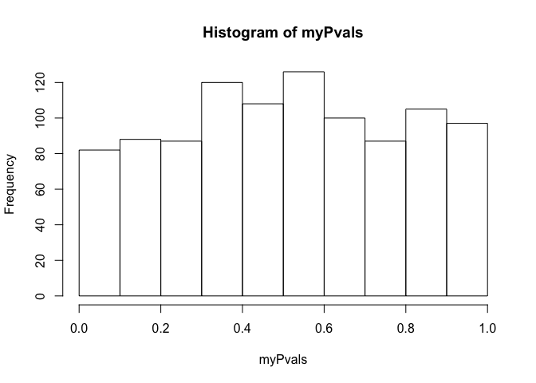
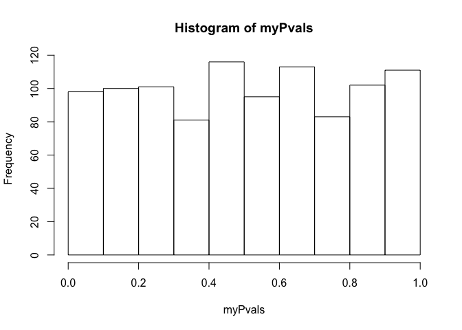

HW2
================
Brandon Turner
2/22/2021

### 1) In a population, there is 1/3 chance that a given person has a mutation in some gene. You sample 30 people; what are the odds that exactly 12 of the people have the mutation. In R plot a probability density function (with dbinom) that shows the distribution for observing exactly (0,1,2,…30) people with the mutation? What is the mean and variance for the expected number of people with the mutation?

#### Exactly 12

``` r
gene_p = 1/3
gene_q = 1 - 1/3
n = 30
k = 13
choose(n, k) * (gene_p** k) * (gene_q ** (n-k))
```

    ## [1] 0.07624011

#### Distribution plot

``` r
n_seq = seq(1,30)
plot(n_seq, dbinom(n_seq, n, gene_p))
```


#### Mean/Var

``` r
myMean = n * (gene_p)
myMean
```

    ## [1] 10

``` r
myVar = sqrt(n * (gene_p) * (gene_q))
myVar
```

    ## [1] 2.581989

## 2) You have (2) The background expected survival rate for a disease is 0.4. You are running a clinical trial. 100 patients on a new drug. 47 patients die (and 53 survive) From the bionomial test:

``` r
surv_p = 0.4
surv_q = 1 - 0.4
n = 100
k = 53
```

#### (2A) Plot out the probability density function with the x-axis the number of patients that survive under the null hypothesis.

``` r
n_seq = seq(1,100)
plot(n_seq, dbinom(n_seq, n, surv_p))
```


#### (2B) What is the p-value for a null hypothesis that the drug has no effect. (Show the one line of R code that produces this p-value)

``` r
binom.test(k, n, surv_p)
```

    ## 
    ##  Exact binomial test
    ## 
    ## data:  k and n
    ## number of successes = 53, number of trials = 100, p-value = 0.01036
    ## alternative hypothesis: true probability of success is not equal to 0.4
    ## 95 percent confidence interval:
    ##  0.4275815 0.6305948
    ## sample estimates:
    ## probability of success 
    ##                   0.53

#### (2C) What is the p-value for a null hypothesis that the drug does not improve survival. (show you can get the same answer with binom.test(….) and sum(dbinom(….))

``` r
binom.test(k, n, surv_p, "greater")
```

    ## 
    ##  Exact binomial test
    ## 
    ## data:  k and n
    ## number of successes = 53, number of trials = 100, p-value = 0.005761
    ## alternative hypothesis: true probability of success is greater than 0.4
    ## 95 percent confidence interval:
    ##  0.4430853 1.0000000
    ## sample estimates:
    ## probability of success 
    ##                   0.53

``` r
sum(dbinom(seq(k,n), n, surv_p))
```

    ## [1] 0.005760648

## Question 3

#### (3A) Use the rbiom function to simulate 1,000 experiments in which 10,000 patients are sampled with a 1/2 chance of seeing a mutation. (You should get 1,000 numbers back with each \# the \# of patients from the 10,000 that had the mutation…) (What is the one line of r-code that would produce myVals?)

``` r
n = 10000
mut_p = 0.5
exMean = n * mut_p
exSD = n * mut_p * mut_p
# first 25 of 1000 sims
myVals = rbinom(1000, n, mut_p)
head(myVals, 25)
```

    ##  [1] 5028 4941 4893 5010 5049 5042 4903 4919 5071 5010 4961 5008 4936 5018 5070
    ## [16] 5054 5025 4971 4953 5023 4993 5000 4936 5031 5016

#### (3B) What is the expected mean and variance of the vector in (3A). Show that the actual mean and variance are close to the expected mean and variance.

``` r
# sample mean
myVals_mean = mean(myVals)
myVals_mean
```

    ## [1] 5000.755

``` r
# expected mean
exMean
```

    ## [1] 5000

``` r
# sample var
myVals_var = var(myVals)
myVals_var
```

    ## [1] 2324.626

``` r
# expected var
exSD
```

    ## [1] 2500

#### (3C) Take the vector that results from (3A). For each element in that vector, calculate a p-value with binom.test(….)$p.value for the null hypothesis that the frequency of the allele in the population for that experiment is 1/2. Graph the histogram of all of those p-values. What distribution would you expect? Is that what you see?

``` r
myPvals = c()
for (i in 1:1000){
  y = binom.test(myVals[i], n, mut_p)
  myPvals[i] = y$p.value
}
# simulations should be uniformly distributed?
hist(myPvals)
```



#### (3D) Change the expected value of 1/2 in (3C) to some other value. What happens to the p-values in the histogram. Would you expect the same shape of the p-value histogram with expected values of .49 as with .51? Why or why not?

``` r
mut_p = 0.51
myVals = rbinom(1000, n, mut_p)
myPvals = c()
for (i in 1:1000){
  y = binom.test(myVals[i], n, mut_p)
  myPvals[i] = y$p.value
}
# simulations should be uniformly distributed?
hist(myPvals)
```

 Same shape
