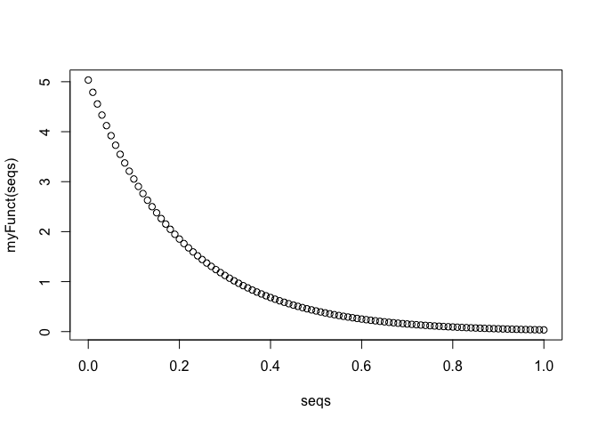
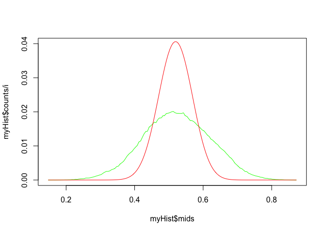
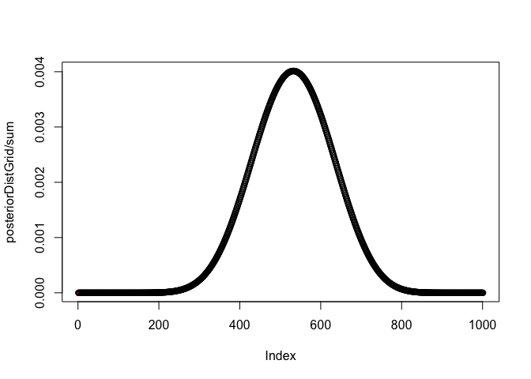
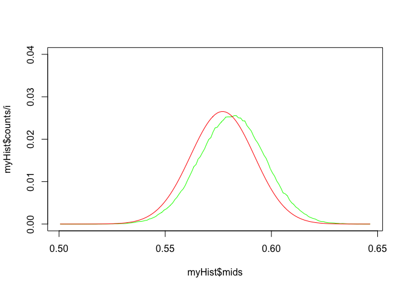
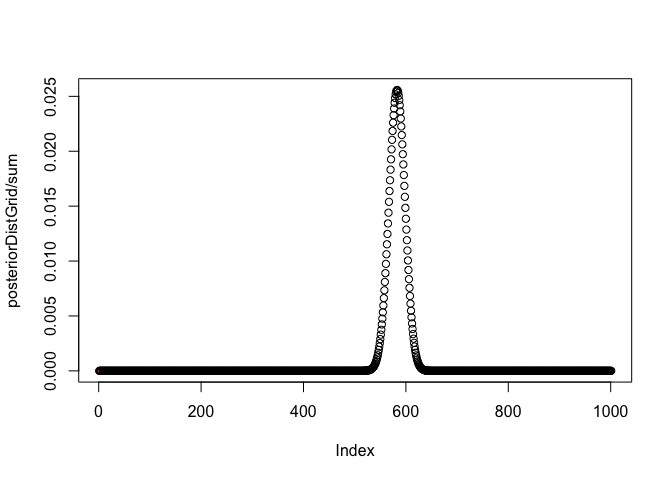

HW4
================
Brandon Turner
3/25/2021

### 1A) Plot the prior graph for a situation for a coin where the prior belief for p(head) is represented by the following R code : dexp(x, rate =5) / 0.9932621 for values of 0 &lt;= x &lt;= 1 and 0 otherwise. (We choose the denominator to make the Integral between 0 and 1 sum to 1).

``` r
seqs = seq(0, 1 ,0.01)
myFunct = function(x) (dexp(x, rate=5)/0.9932621)
plot(seqs, myFunct(seqs))
```



### 1B) Calculate the posterior graph with both the Metropolis algorithm and grid approximation for a case with 14 heads and 10 tails (where x = prob(head)) .Show the two methods roughly agree. Compare these to a plot with a posterior for new data of 14 heads and 10 tails with a prior with beta(40,40).

(So for the observation of 14 heads and 10 tails you will end up with a graph with three plots superimposed: (i) the Metropolis algorithm with an exp prior, (ii) grid approximation with an exp prior and (iii) exact analytical solution from a beta(40,40) prior make the plots different colors so you can visualize them…)

``` r
# number of times to run
numIterations <- 500000

# metro algo vars
piOld <- 0.5
posteriorDist <- vector()
xVals <- seq(0,1,1/numIterations);
for( i in 1:numIterations )
{

  # metro post
    pOld <- dbinom( 14, 24, piOld) * (dexp(piOld, rate=5)/0.9932621)
  
    piNew <- piOld + rnorm(1, 0, sd =0.01);
    
    if( piNew > 1) 
        piNew = 1;
    
    if( piNew < 0 ) 
        piNew = 0;
        
    pNew <- dbinom( 14, 24, piNew) * (dexp(piNew, rate=5)/0.9932621)
    
    ratio <- pNew / pOld
    
    if( ratio > 1 || ratio >= runif(1) ) 
        piOld = piNew;
        
    posteriorDist[i] = piOld;   
}

# plot metro 
myHist <- hist(posteriorDist, breaks=200, plot=FALSE)
plot( myHist$mids, myHist$counts/i, ylim=c(0,0.04), col='green', type='l') 


# grid method vars
numBreaks=1000;
posteriorDistGrid <- vector(length=numBreaks)
xVals <- seq(0,1,1/numBreaks);
i <- 1;
sum <- 0;

# grid algo 
for( x in xVals )
{
    posteriorDistGrid[i] <- (dexp(x, rate=5)/0.9932621) * dbinom( 14, 24, x)
    sum = sum + posteriorDistGrid[i];
    i <- i + 1; 
}

# plot beta 
dbetasum = sum(dbeta(myHist$mids, 40+10, 40+14))
lines( myHist$mids, dbeta(myHist$mids, 40+14, 40+10)/dbetasum, col="red")
```



``` r
# plot grid
plot(posteriorDistGrid/sum)
gridHist = hist(posteriorDistGrid, breaks=200, plot=FALSE)
lines( gridHist$mids, dbeta(gridHist$mids, 40+14, 40+10)/dbetasum, col="red")
```



### 1C) Repeat the above calculation but for a case of 583 heads and 417 tails. (You may need to adjust your model step parameters to try and get the grid and Metropolis graphs to match up). How do the three posterior curves relate to each other now? Why does this plot look different than the plot in (1B)?

``` r
# number of times to run
numIterations <- 500000

# metro algo vars
piOld <- 0.5
posteriorDist <- vector()
xVals <- seq(0,1,1/numIterations);
for( i in 1:numIterations )
{

  # metro post
    pOld <- dbinom( 583, 583+417, piOld) * (dexp(piOld, rate=5)/0.9932621)
  
    piNew <- piOld + rnorm(1, 0, sd =0.01);
    
    if( piNew > 1) 
        piNew = 1;
    
    if( piNew < 0 ) 
        piNew = 0;
        
    pNew <- dbinom( 583, 583+417, piNew) * (dexp(piNew, rate=5)/0.9932621)
    
    ratio <- pNew / pOld
    
    if( ratio > 1 || ratio >= runif(1) ) 
        piOld = piNew;
        
    posteriorDist[i] = piOld;   
}

# plot metro 
myHist <- hist(posteriorDist, breaks=200, plot=FALSE)
plot( myHist$mids, myHist$counts/i, ylim=c(0,0.04), col='green', type='l') 


# grid method vars
numBreaks=1000;
posteriorDistGrid <- vector(length=numBreaks)
xVals <- seq(0,1,1/numBreaks);
i <- 1;
sum <- 0;

# grid algo 
for( x in xVals )
{
    posteriorDistGrid[i] <- (dexp(x, rate=5)/0.9932621) * dbinom( 583, 583+417, x)
    sum = sum + posteriorDistGrid[i];
    i <- i + 1; 
}

# plot beta 
dbetasum = sum(dbeta(myHist$mids, 40+583, 40+417))
lines( myHist$mids, dbeta(myHist$mids, 40+583, 40+417)/dbetasum, col="red")
```



``` r
# plot grid
plot(posteriorDistGrid/sum)
gridHist = hist(posteriorDistGrid, breaks=200, plot=FALSE)
lines( gridHist$mids, dbeta(gridHist$mids, 40+583, 40+417)/dbetasum, col="red")
```


