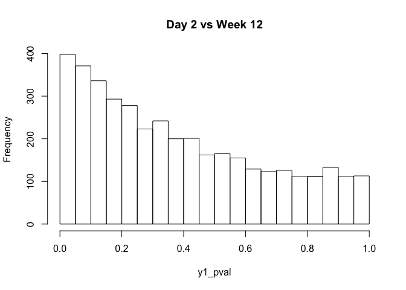

HW5
================
Brandon Turner
4/12/2021

## 1) We will utilize our RNA seq dataset of E. Coli genes from mice. Read and normalize the counts table ( “nc101\_scaff\_dataCounts.txt “ into R).

``` r
# read in data
myData = read.table('/Users/bturne48/Documents/GitHub/AdvStats/HW5/longitdunalRNASeqData/nc101_scaff_dataCounts.txt', header = T, row.names = 1, sep ='\t', colClasses = c('character', rep('numeric', 11)))

# remove rare genes
myData = myData[apply(myData, 1, median) > 5, ]

# normalize
myData_norm = myData
for (i in 1:ncol(myData)){
  colSum = sum(myData[,i])
  myData_norm[,i] = myData_norm[,i]/colSum
}
head(myData_norm)
```

    ##                    D2_01        D2_02        D2_03       W12_01       W12_02
    ## NC101_00003 5.680896e-04 1.838224e-04 5.226435e-04 3.748604e-04 3.906539e-04
    ## NC101_00004 5.180148e-05 1.267740e-05 7.839653e-05 2.705178e-05 7.665312e-05
    ## NC101_00005 2.503738e-04 3.359512e-04 3.005200e-04 4.714739e-04 2.502771e-04
    ## NC101_00006 8.806252e-04 5.070962e-04 7.055688e-04 6.028683e-04 6.621721e-04
    ## NC101_00007 8.633580e-06 1.901611e-05 0.000000e+00 5.023902e-05 2.308829e-05
    ## NC101_00008 2.417403e-05 2.535481e-05 2.613218e-05 3.091632e-05 6.002955e-05
    ##                   W12_03       w20_01       w20_02       w20_03       w20_04
    ## NC101_00003 3.327968e-04 3.955886e-04 4.990602e-04 5.194085e-04 4.562896e-04
    ## NC101_00004 8.024887e-05 6.410392e-05 6.566582e-05 7.697117e-05 8.127459e-05
    ## NC101_00005 3.021134e-04 8.603420e-05 8.317671e-05 7.873387e-05 7.167523e-05
    ## NC101_00006 4.555303e-04 4.124581e-04 3.327068e-04 3.149355e-04 3.116593e-04
    ## NC101_00007 2.360261e-06 7.591253e-06 2.918481e-06 1.762698e-05 5.759617e-06
    ## NC101_00008 3.304365e-05 1.754423e-04 1.196577e-04 1.774450e-04 1.542297e-04
    ##                   w20_05
    ## NC101_00003 7.653778e-05
    ## NC101_00004 9.567223e-05
    ## NC101_00005 1.913445e-05
    ## NC101_00006 8.389719e-05
    ## NC101_00007 1.619069e-05
    ## NC101_00008 2.060633e-05

## 2) For every row in the normalized spreadsheet, run three t-tests ( “day 2” vs. “week 12”, “day 2” vs. “week 18” and “week 12” vs. “week 18”. At a p &lt; .05 threshold fill in the following table:

``` r
# uncorrected ounts
y1_uncor = 0
y1_pval = c()
y2_uncor = 0
y2_pval = c()
y3_uncor = 0
y3_pval = c()
for (i in 1:nrow(myData_norm)){
  # day 2 vs week 12
  y1_pval[i] = t.test(myData_norm[i,1:3], myData_norm[i,4:6])$p.value
  if (y1_pval[i] <= 0.05) {
    y1_uncor = y1_uncor + 1
  }
  
  # day 2 vs week 18
  y2_pval[i] = t.test(myData_norm[i,1:3], myData_norm[i,7:11])$p.value
  if (y2_pval[i] <= 0.05) {
    y2_uncor = y2_uncor + 1
  }
  
  # week 12 vs week 18
  y3_pval[i] = t.test(myData_norm[i,4:6], myData_norm[i,7:11])$p.value
  if (y3_pval[i] <= 0.05) {
    y3_uncor = y3_uncor + 1
  }
  
}
uncorrected_res = c(y1_uncor, y2_uncor, y3_uncor)


# FDR corrected
x = sum(p.adjust(y1_pval, 'BH') < 0.05)
y = sum(p.adjust(y2_pval, 'BH') < 0.05) 
z = sum(p.adjust(y3_pval, 'BH') < 0.05)
fdr_corrected_res = c(x,y,z)


# Bon corrected
bonf_corrected_res = c(sum(p.adjust(y1_pval, "bonferroni") <= 0.05), sum(p.adjust(y2_pval, "bonferroni") <= 0.05), sum(p.adjust(y3_pval, "bonferroni") <= 0.05))


# results df 
endTable = data.frame(uncorrected_res, fdr_corrected_res, bonf_corrected_res)
endTable
```

    ##   uncorrected_res fdr_corrected_res bonf_corrected_res
    ## 1             398                 0                  0
    ## 2            1243               279                  3
    ## 3             810                15                  1

## 3) Make histograms of all the uncorrected p-values for each of the three companions. Are any of the distributions uniform?

``` r
# use breaks=20 so that the counts field in the histogram can be parsed (hist[1:2] = all pvals < 0.05)
hist1 = hist(y1_pval, main ='Day 2 vs Week 12', breaks = 20)
```



``` r
hist2 = hist(y2_pval, main ='Day 2 vs Week 18', breaks = 20)
```


``` r
hist3 = hist(y3_pval, main ='Week 12 vs Week 18', breaks = 20)
```


None of the histrograms appear to show a unif dist

## 4) Based on these data, when is the biggest shift in the transcriptome? Which samples are most different from one another?

``` r
# sum all pvals below 0.05 for all 3 comparisons
sum(hist1$counts[1:2])
```

    ## [1] 769

``` r
sum(hist2$counts[1:2])
```

    ## [1] 1663

``` r
sum(hist3$counts[1:2])
```

    ## [1] 1228

Day 2 vs Week 18 shows the most values that show p &lt; 0.05.
