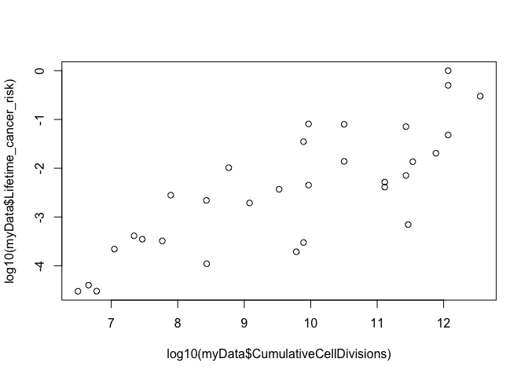
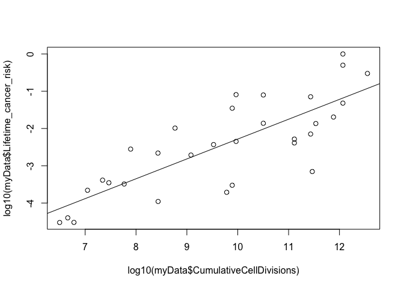
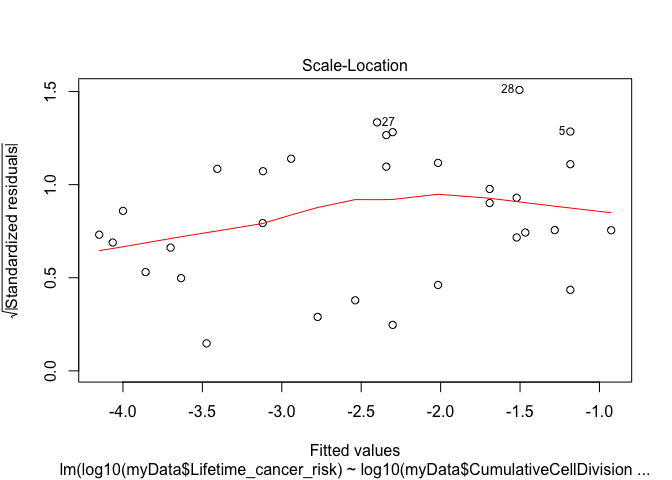
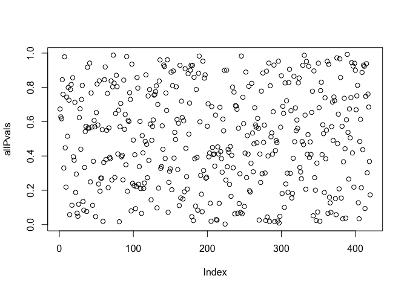
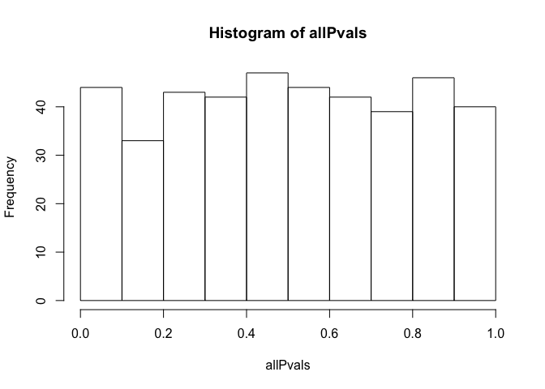

HW6
================
Brandon Turner
4/28/2021

### 1A) Download the data from here examining the relationship between the number of cell divisions and cancer risk. On a log10-log10 scale graph Lifetime\_cancer\_risk (on the y-axis) vs. CumulativeCellDivisions (on the x-axis). (This reproduces Fig. 1 from the paper).

``` r
myData = read.table('/Users/bturne48/Documents/GitHub/AdvStats/HW6/cancerRisk.txt', header = T)
plot(log10(myData$CumulativeCellDivisions), log10(myData$Lifetime_cancer_risk))
```



### 1B) Using the lm function, fit a linear model with Lifetime\_cancer\_risk as the Y variable and CumulativeCellDivisions as the x-data. Add the regression line to the plot using the function abline(myLm) (where myLm is the linear model you created).

``` r
plot(log10(myData$CumulativeCellDivisions), log10(myData$Lifetime_cancer_risk))
myMod = lm(log10(myData$Lifetime_cancer_risk) ~ log10(myData$CumulativeCellDivisions))
abline(myMod)
```



### 1C) What is the p-value for the null hypothesis that the slope of the regression between these two variables is zero? What is the r-squared value of the model?

``` r
summary(myMod)
```

    ## 
    ## Call:
    ## lm(formula = log10(myData$Lifetime_cancer_risk) ~ log10(myData$CumulativeCellDivisions))
    ## 
    ## Residuals:
    ##      Min       1Q   Median       3Q      Max 
    ## -1.65115 -0.46564  0.06167  0.43180  1.21040 
    ## 
    ## Coefficients:
    ##                                       Estimate Std. Error t value Pr(>|t|)    
    ## (Intercept)                           -7.61081    0.72292 -10.528 2.03e-11 ***
    ## log10(myData$CumulativeCellDivisions)  0.53264    0.07317   7.279 5.12e-08 ***
    ## ---
    ## Signif. codes:  0 '***' 0.001 '**' 0.01 '*' 0.05 '.' 0.1 ' ' 1
    ## 
    ## Residual standard error: 0.7491 on 29 degrees of freedom
    ## Multiple R-squared:  0.6463, Adjusted R-squared:  0.6341 
    ## F-statistic: 52.99 on 1 and 29 DF,  p-value: 5.124e-08

R2 = 0.6341, p-val = 5.124e-08

### 1D) Are the assumptions of constant variance and normal distribution of the residues reasonable for this model? Justify your answer.

``` r
plot(myMod, 3)
```



The scale-location plot shows that the residuals for the most part have constant variance, as they do not appear to be correlated to each other.

``` r
shapiro.test(myMod$residuals)
```

    ## 
    ##  Shapiro-Wilk normality test
    ## 
    ## data:  myMod$residuals
    ## W = 0.97375, p-value = 0.6271

The shapiro test of normality has a p-value of 0.6271, meaning we fail to reject the null hypothesis that the residuals are normally distributed.

### 2) For each OTU in the spreadsheet, generate a p-value from linear regression comparing BMI to the relative abundance of each OTU. Graph out all the p-values. Do they appear uniformly distributed? Does the microbial community appear to be influencing body weight in this cohort? Are any of these associations significant at a 10% false discovery rate?

``` r
# read in case control data
ccData = read.table('/Users/bturne48/Documents/GitHub/AdvStats/HW6/caseControlData.txt', header = T)
sampleID = ccData$sample

key <- sub("case", "", sampleID)
key <- sub("control", "", key)
    
# remove extraneous information from the suffix
key <- strsplit( key, "_")
newList = c()
for (i in 1:length(key)){
  newList[i] = key[[i]][1]
}
ccData$sample = newList

# read in bmi data
bmiData = read.table('/Users/bturne48/Documents/GitHub/AdvStats/HW6/BMI_Data.txt', header = T)

# sort data
mergeFrames = merge(bmiData, ccData, by.x="studyid", by.y="sample")

# all lms
allPvals = c()
count = 1
for (i in 3:ncol(mergeFrames)){
  myMod = lm(mergeFrames$bmi ~ mergeFrames[,i])
  allPvals[count] = anova(myMod)$'Pr(>F)'[1]
  count = count + 1
}

# plot all pvals
plot(allPvals)
```



``` r
# plot hist of pvals
hist(allPvals)
```



``` r
# FDR corrected
fdr_corrected_res = sum(p.adjust(allPvals, 'BH') < 0.05)
fdr_corrected_res
```

    ## [1] 0

The p-vals do appear to be uniformally distributed, suggesting that the OTU's arent having much of an effect.
