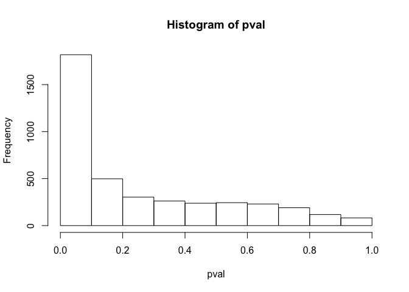
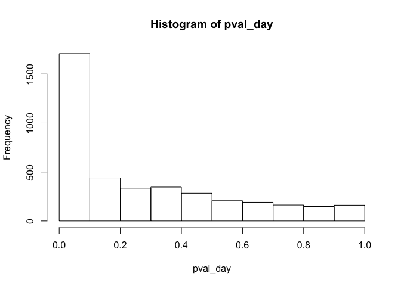
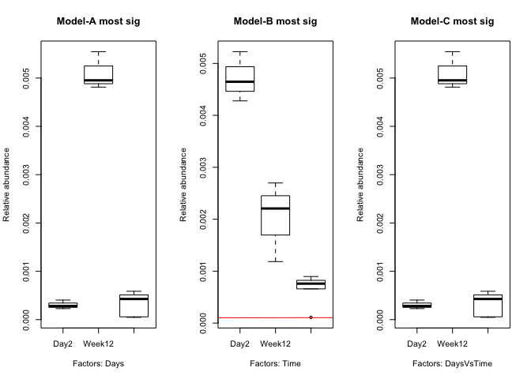

HW7
================
Brandon Turner
4/30/2021

### 1A) We again return to our RNA seq dataset of E. Coli genes from mice. As before, read and normalize the counts table ( “nc101\_scaff\_dataCounts.txt “ into R). For each row in the spreadsheet, perform a one-way ANOVA with categories “day 2”, “week 12” and “week 18”. Plot out the histogram of all p-values. How many genes are significant at a BH FDR-corrected 0.05 threshold.

``` r
myData = read.table('/Users/bturne48/Documents/GitHub/AdvStats/HW5/longitdunalRNASeqData/nc101_scaff_dataCounts.txt', header = T, row.names = 1, sep ='\t', colClasses = c('character', rep('numeric', 11)))

# remove rare genes
myData = myData[apply(myData,1,median) > 5, ]

# normalize
myData_norm = myData
for (i in 1:ncol(myData)){
  colSum = sum(myData[,i])
  myData_norm[,i] = myData_norm[,i]/colSum
}

# as factors 
myFactors = factor(c(rep('Day2',3), rep('Week12',3), rep('Week18',5)))
pval = vector(mode="numeric", length = nrow(myData_norm))

for (i in 1:nrow(myData_norm)){
  currentRow = as.numeric(myData_norm[i,])
  myMod = lm(currentRow ~ myFactors, x=T)
  pval[i] = anova(myMod)$"Pr(>F"[1]
  #t.test(day2, week12)
}

# histogram of pvals
hist(pval)
```



``` r
# signif genes at 0.05
sum(p.adjust(pval, 'BH') < 0.05)
```

    ## [1] 612

### 1B) Next make an ANOVA as a linear regression as a function of time (so 2 days, 86 days and 128 days). Plot out the histogram of all p-values. How many genes are significant at a BH FDR-corrected 0.05 threshold.

``` r
pval_day = vector(mode="numeric", length = nrow(myData_norm))

dayFactors = c(rep(2,3), rep(86,3), rep(128,5))

for (i in 1:nrow(myData_norm)){
  currentRow_day = as.numeric(myData_norm[i,])
  myMod_day = lm(currentRow_day ~ dayFactors, x=TRUE)
  pval_day[i] = anova(myMod_day)$"Pr(>F"[1]
  #t.test(day2, week12)
}

# histogram of pvals
hist(pval_day)
```



``` r
# signif genes at 0.05
sum(p.adjust(pval_day, 'BH') < 0.05)
```

    ## [1] 448

### 1C) Finally, for each row in the spreadsheet perform an ANVOA comparing the three-parameter model from (A) and the two parameter model from (B). Plot out the histogram of all p-values. For how many genes is there a significant difference between these two models at a BH FDR-corrected threshold.

``` r
pval_compare = vector(mode="numeric", length = nrow(myData_norm))

for (i in 1:nrow(myData_norm)){
  #model 1
  currentRow = as.numeric(myData_norm[i,])
  myMod = lm(currentRow ~ myFactors, x=T)
  # model 2
  currentRow_day = as.numeric(myData_norm[i,])
  myMod_day = lm(currentRow_day ~ dayFactors, x=T)
  # residuals 
  firstModelRes = sum(residuals(myMod) ^ 2)
  secondModelRes = sum(residuals(myMod_day) ^ 2)
  # fstat
  Fstat = ((secondModelRes - firstModelRes)/(1)) / (firstModelRes/8)
  # pf
  pval_compare[i] = pf(Fstat, 1, 8, lower.tail = F)
}

# signif genes at 0.05
sum(p.adjust(pval_compare, 'BH') < 0.05)
```

    ## [1] 51

### 1D) Make three graphs showing the relative abundance of the most significant gene under each of the three ANOVA models. For (A) and (C), the x-axis will the category (day 3, week 12 and week 18) and the y-axis will be the relative abundance. Be sure to properly label and title all graphs and axes. For (B) the x-axis will be time (in days) and the y-axis will be the relative abundance. For the graph of the top hit from (B), include the regression line for the plot from (B).

``` r
# create a data frame with all entries
df = data.frame(0, 0, 0, 0)
for (i in 1:length(pval)){
  df[nrow(df) + 1,] = c(i, pval[i], pval_day[i], pval_compare[i])
}
df = df[2:nrow(df),]

# order df's
order_df1 = df[order(df$X0.1), ]
order_df2 = df[order(df$X0.2), ]
order_df3 = df[order(df$X0.3), ]

# boxplots
par(mfrow=c(1,3))
boxplot(as.numeric(myData_norm[order_df1$X0[1], ]) ~ myFactors, xlab='Factors: Days', ylab='Relative abundance', main='Model-A most sig')
boxplot(as.numeric(myData_norm[order_df2$X0[1], ]) ~ myFactors, xlab='Factors: Time', ylab='Relative abundance', main='Model-B most sig')
abline(myMod_day, col='red')
boxplot(as.numeric(myData_norm[order_df3$X0[1], ]) ~ myFactors, xlab='Factors: DaysVsTime', ylab='Relative abundance', main='Model-C most sig')
```



### 1E) Overall, do you think the three parameter model in (A) or the two-parameter model in (B) is more appropriate for these data? Justify your answer.

I believe that the two paramater model is better because it is the simpler model that can explain our data.
